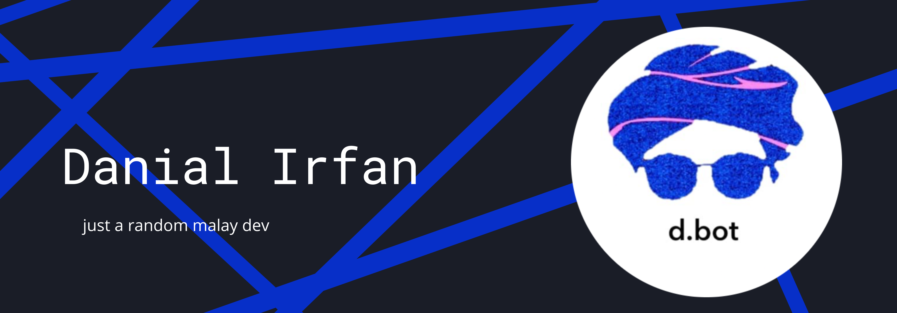

    Assalamualaikum and Hi, I'm 
<a href="https://danialirfan.netlify.app" target="_blank" rel="noreferrer">danial</a>

<h2 align="center">I'm a Junior Frontend Web developer</h2>

I am just a boy that is fascinated by programming and is still looking for something that he is good at. I am also improving to become a better programmer by learning new things. And I use Arch BTW.

### 🤝 My contacts :

- [Website](https://danialirfan.netlify.app)
- [Instagram](https://instagram.com/danial_dev01)
- [Twitter](https://twitter.com/DaniDevelopers)
- [Slack](https://join.slack.com/t/dbotdevworkspace/shared_invite/zt-122k7bh5s-3bhmtuzF6YKAQe8MbE1PyA)

### My Skills :

### My  Preferred Tools:

